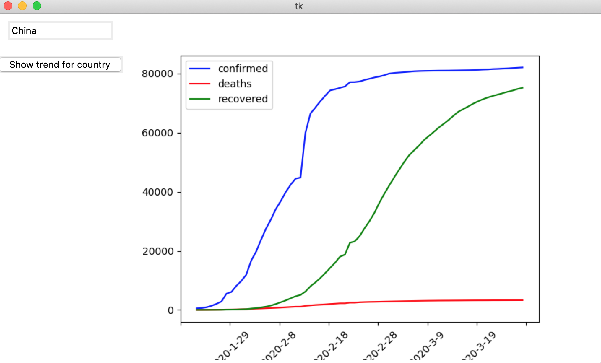

This is a code which shows how to create your own Covid-19 plots for various countries using Python by creating a graphical user interface. 
This is used in the video: https://youtu.be/kxPrwR4rwyw

The data is taken from here: https://pomber.github.io/covid19/timeseries.json

